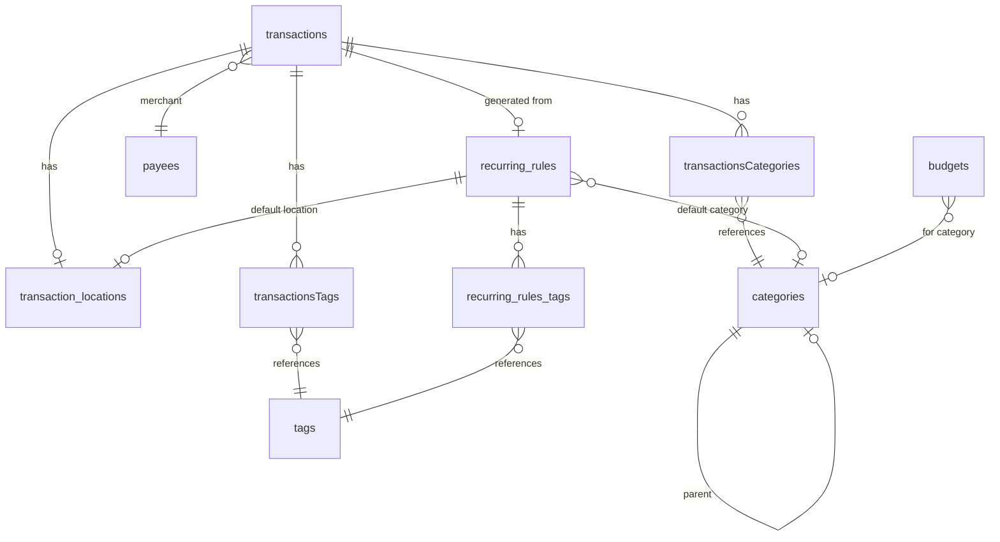

# Expense Tracking Schema Finalization

## Current State

Your existing schema in [Sources/SharedModels/Schema.swift](Sources/SharedModels/Schema.swift) has:

- `transactions` - Core data with location FK
- `transaction_locations` - Geo data
- `categories` / `transactionsCategories` - Hierarchical categories
- `tags` / `transactionsTags` - Flexible tagging

## Schema Changes

### 1. Enhanced Transaction Table

Add these columns to `transactions`:| Column | Type | Purpose ||--------|------|---------|| `status` | INTEGER | 0=pending, 1=posted, 2=cleared, 3=reconciled || `merchantName` | TEXT | Normalized merchant/payee name || `notes` | TEXT | Longer form notes beyond description || `originalValueMinorUnits` | INTEGER | Original amount in foreign currency || `originalCurrencyCode` | TEXT | Foreign currency code (null = same as currencyCode) || `exchangeRate` | REAL | Conversion rate used (null = 1.0) || `transactionDate` | TEXT | When the transaction occurred (user-editable date) || `postedDate` | TEXT | When it cleared/posted (null if pending) || `recurringRuleID` | TEXT | FK to recurring_rules (null if one-time) || `externalID` | TEXT | For future bank import reconciliation || `isVoided` | INTEGER | Soft delete flag (0=active, 1=voided) || `checkNumber` | TEXT | Optional check number |

### 2. New Table: `recurring_rules`

Templates for recurring transactions:

```javascript
recurring_rules
├── id (TEXT PK)
├── description (TEXT)
├── valueMinorUnits (INTEGER)
├── currencyCode (TEXT)
├── type (INTEGER) - expense/income
├── merchantName (TEXT)
├── categoryID (TEXT FK) - default category
├── frequency (INTEGER) - 0=daily, 1=weekly, 2=biweekly, 3=monthly, 4=yearly
├── interval (INTEGER) - every X periods (default 1)
├── dayOfMonth (INTEGER) - 1-31, null for weekly
├── dayOfWeek (INTEGER) - 0-6 (Sun-Sat), null for monthly
├── startDate (TEXT) - when to start generating
├── endDate (TEXT) - optional end date
├── nextDueDate (TEXT) - next scheduled occurrence
├── lastGeneratedDate (TEXT) - last time a transaction was created
├── isActive (INTEGER) - 0=paused, 1=active
├── autoPost (INTEGER) - 0=create as pending, 1=create as posted
├── createdAtUTC (TEXT)
└── locationID (TEXT FK) - optional default location
```


### 3. New Table: `budgets`

Budget tracking per category:

```javascript
budgets
├── id (TEXT PK)
├── categoryID (TEXT FK) - null = overall budget
├── periodType (INTEGER) - 0=weekly, 1=monthly, 2=yearly
├── amountMinorUnits (INTEGER)
├── currencyCode (TEXT)
├── startDate (TEXT) - when budget period begins
├── endDate (TEXT) - optional, null = ongoing
├── rollover (INTEGER) - 0=no, 1=yes (carry unspent to next period)
├── isActive (INTEGER) - 0=inactive, 1=active
└── createdAtUTC (TEXT)
```


### 4. New Table: `payees` (optional but recommended)

Normalized merchant/payee list for autocomplete and default categories:

```javascript
payees
├── name (TEXT PK, COLLATE NOCASE)
├── defaultCategoryID (TEXT FK)
├── isArchived (INTEGER)
└── createdAtUTC (TEXT)
```


### 5. New Join Table: `recurring_rules_tags`

Default tags for recurring transactions:

```javascript
recurring_rules_tags
├── id (TEXT PK)
├── recurringRuleID (TEXT FK)
└── tagID (TEXT FK)
```


## Entity Relationship Diagram




## New Indexes

- `idx_transactions_status` - Filter by pending/posted
- `idx_transactions_recurringRuleID` - Find instances of recurring rule
- `idx_transactions_merchantName` - Search by merchant
- `idx_transactions_transactionDate` - Filter by user-set date
- `idx_transactions_isVoided` - Exclude voided transactions
- `idx_recurring_rules_nextDueDate` - Find due recurring items
- `idx_budgets_categoryID` - Lookup budget by category
- `idx_budgets_periodType` - Filter by period

## Model Updates

Update [Sources/SharedModels/Models.swift](Sources/SharedModels/Models.swift) with:

- New enums: `TransactionStatus`, `RecurringFrequency`, `BudgetPeriodType`
- New `@Table` structs: `RecurringRule`, `Budget`, `Payee`, `RecurringRuleTag`
- Updated `Transaction` with new fields