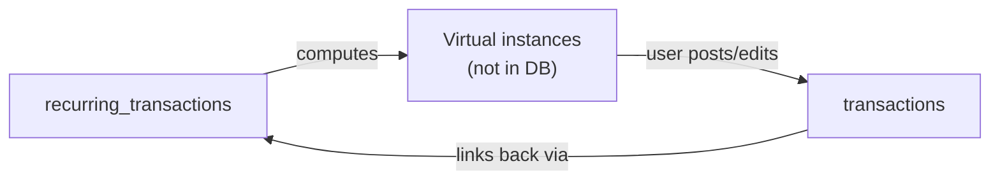

# Recurring Transactions Schema

## How It Works




1. **recurring_transactions** stores templates with recurrence patterns
2. When viewing a date range, the app computes which occurrences fall in that range
3. Virtual instances are shown for dates without a real transaction
4. When the user marks as posted or edits, a real `transaction` is created
5. The transaction links back via `recurringTransactionID` + `occurrenceDate`

---

## New Table: `recurring_transactions`

```sql
CREATE TABLE "recurring_transactions" (
  "id" TEXT PRIMARY KEY NOT NULL DEFAULT (uuid()),

  -- Template data (copied to transaction instances)
  "description" TEXT NOT NULL DEFAULT '',
  "valueMinorUnits" INTEGER NOT NULL DEFAULT 0,
  "currencyCode" TEXT NOT NULL DEFAULT '',
  "type" INTEGER NOT NULL DEFAULT 0,
  "merchantName" TEXT,
  "notes" TEXT,
  "locationID" TEXT REFERENCES "transaction_locations"("id") ON DELETE SET NULL,

  -- Recurrence pattern
  "frequency" INTEGER NOT NULL DEFAULT 3,
  "interval" INTEGER NOT NULL DEFAULT 1,
  "daysOfWeekBitmask" INTEGER,
  "daysOfMonthBitmask" INTEGER,
  "weekOfMonth" INTEGER,
  "dayOfWeekForMonthly" INTEGER,

  -- Schedule bounds
  "startDate" TEXT NOT NULL,
  "endDate" TEXT,

  -- State
  "isActive" INTEGER NOT NULL DEFAULT 1,
  "createdAtUTC" TEXT NOT NULL DEFAULT (datetime('now'))
) STRICT
```


### Column Details

| Column | Type | Description ||--------|------|-------------|| `frequency` | INTEGER | 0=daily, 1=weekly, 2=biweekly, 3=monthly, 4=quarterly, 5=yearly || `interval` | INTEGER | Every X periods (default 1). E.g., interval=2 + monthly = every 2 months || `daysOfWeekBitmask` | INTEGER | For weekly: bitmask where bit 0=Sun, 1=Mon, ..., 6=Sat. E.g., 0b0100010 = Mon+Fri || `daysOfMonthBitmask` | INTEGER | For monthly: bitmask where bit 0=day 1, ..., bit 30=day 31, bit 31=last day of month. E.g., 1st and 15th = 0x4001 || `weekOfMonth` | INTEGER | For "Nth weekday": 1=first, 2=second, 3=third, 4=fourth, 5=last || `dayOfWeekForMonthly` | INTEGER | For "Nth weekday": 0=Sun, 1=Mon, ..., 6=Sat || `startDate` | TEXT | First possible occurrence (ISO date) || `endDate` | TEXT | Last possible occurrence (null = forever) || `isActive` | INTEGER | 0=paused, 1=active |

### Pattern Examples

| Pattern | frequency | interval | daysOfWeekBitmask | daysOfMonthBitmask | weekOfMonth | dayOfWeekForMonthly ||---------|-----------|----------|-------------------|---------------------|-------------|---------------------|| Monthly on 1st | 3 (monthly) | 1 | null | 1 (bit 0) | null | null || Monthly on 15th | 3 (monthly) | 1 | null | 16384 (bit 14) | null | null || Monthly 1st and 15th | 3 (monthly) | 1 | null | 16385 (bits 0+14) | null | null || Monthly last day | 3 (monthly) | 1 | null | 2147483648 (bit 31) | null | null || First Monday of month | 3 (monthly) | 1 | null | null | 1 | 1 || Last Friday of month | 3 (monthly) | 1 | null | null | 5 | 5 || Every Monday | 1 (weekly) | 1 | 2 (bit 1) | null | null | null || Mon, Wed, Fri | 1 (weekly) | 1 | 42 (bits 1+3+5) | null | null | null || Every other Friday | 2 (biweekly) | 1 | 32 (bit 5) | null | null | null || Quarterly on 1st | 4 (quarterly) | 1 | null | 1 (bit 0) | null | null || Daily | 0 (daily) | 1 | null | null | null | null || Every 3 days | 0 (daily) | 3 | null | null | null | null || Yearly on Jan 15 | 5 (yearly) | 1 | null | 16384 (bit 14) | null | null |---

## Updates to `transactions` Table

Add these columns:

```sql
-- Transaction status
"status" INTEGER NOT NULL DEFAULT 1,

-- Link to recurring source
"recurringTransactionID" TEXT REFERENCES "recurring_transactions"("id") ON DELETE SET NULL,
"occurrenceDate" TEXT
```

| Column | Type | Description ||--------|------|-------------|| `status` | INTEGER | 0=pending, 1=posted, 2=cleared || `recurringTransactionID` | TEXT | FK to recurring_transactions (null for one-time transactions) || `occurrenceDate` | TEXT | Which occurrence this represents (ISO date, e.g., "2024-12-01") |

### Status Values

| Value | Name | Description ||-------|------|-------------|| 0 | pending | Expected but not yet paid (to-do item) || 1 | posted | Payment made, waiting to clear || 2 | cleared | Fully processed/reconciled |---

## Join Tables

### `recurring_transactions_categories`

```sql
CREATE TABLE "recurring_transactions_categories" (
  "id" TEXT PRIMARY KEY NOT NULL DEFAULT (uuid()),
  "recurringTransactionID" TEXT NOT NULL REFERENCES "recurring_transactions"("id") ON DELETE CASCADE,
  "categoryID" TEXT NOT NULL REFERENCES "categories"("title") ON DELETE CASCADE ON UPDATE CASCADE,
  UNIQUE("recurringTransactionID", "categoryID") ON CONFLICT IGNORE
) STRICT
```


### `recurring_transactions_tags`

```sql
CREATE TABLE "recurring_transactions_tags" (
  "id" TEXT PRIMARY KEY NOT NULL DEFAULT (uuid()),
  "recurringTransactionID" TEXT NOT NULL REFERENCES "recurring_transactions"("id") ON DELETE CASCADE,
  "tagID" TEXT NOT NULL REFERENCES "tags"("title") ON DELETE CASCADE ON UPDATE CASCADE,
  UNIQUE("recurringTransactionID", "tagID") ON CONFLICT IGNORE
) STRICT
```

---

## Indexes

```sql
-- For finding transaction instances of a recurring source
CREATE INDEX "idx_transactions_recurringTransactionID" ON "transactions"("recurringTransactionID");

-- For checking if an occurrence already exists
CREATE INDEX "idx_transactions_occurrence" ON "transactions"("recurringTransactionID", "occurrenceDate");

-- For filtering by status
CREATE INDEX "idx_transactions_status" ON "transactions"("status");

-- For finding active recurring transactions
CREATE INDEX "idx_recurring_transactions_isActive" ON "recurring_transactions"("isActive");

-- Join table indexes
CREATE INDEX "idx_recurring_transactions_categories_recurringTransactionID"
  ON "recurring_transactions_categories"("recurringTransactionID");
CREATE INDEX "idx_recurring_transactions_tags_recurringTransactionID"
  ON "recurring_transactions_tags"("recurringTransactionID");
```

---

## Model Updates for [Models.swift](Sources/SharedModels/Models.swift)

### New Enums

```swift
extension Transaction {
    enum Status: Int, QueryBindable, Sendable {
        case pending = 0
        case posted = 1
        case cleared = 2
    }
}

enum RecurringFrequency: Int, QueryBindable, Sendable {
    case daily = 0
    case weekly = 1
    case biweekly = 2
    case monthly = 3
    case quarterly = 4
    case yearly = 5
}
```


### New @Table Structs

- `RecurringTransaction` - Main template struct
- `RecurringTransactionCategory` - Join table
- `RecurringTransactionTag` - Join table

### Updated Transaction

Add fields: `status`, `recurringTransactionID`, `occurrenceDate`---

## App Logic (Not Schema, but for context)

The recurrence computation will live in Swift code:

```swift
func occurrences(
    for recurring: RecurringTransaction,
    in dateRange: Range<Date>
) -> [Date] {
    // Compute all occurrence dates within the range
    // based on frequency, interval, daysOfWeekBitmask, daysOfMonthBitmask, etc.
}

func virtualInstances(
    for recurring: RecurringTransaction,
    in dateRange: Range<Date>,
    existingTransactions: [Transaction]
) -> [VirtualTransaction] {
    // Return occurrences that don't have a real transaction yet
}

```